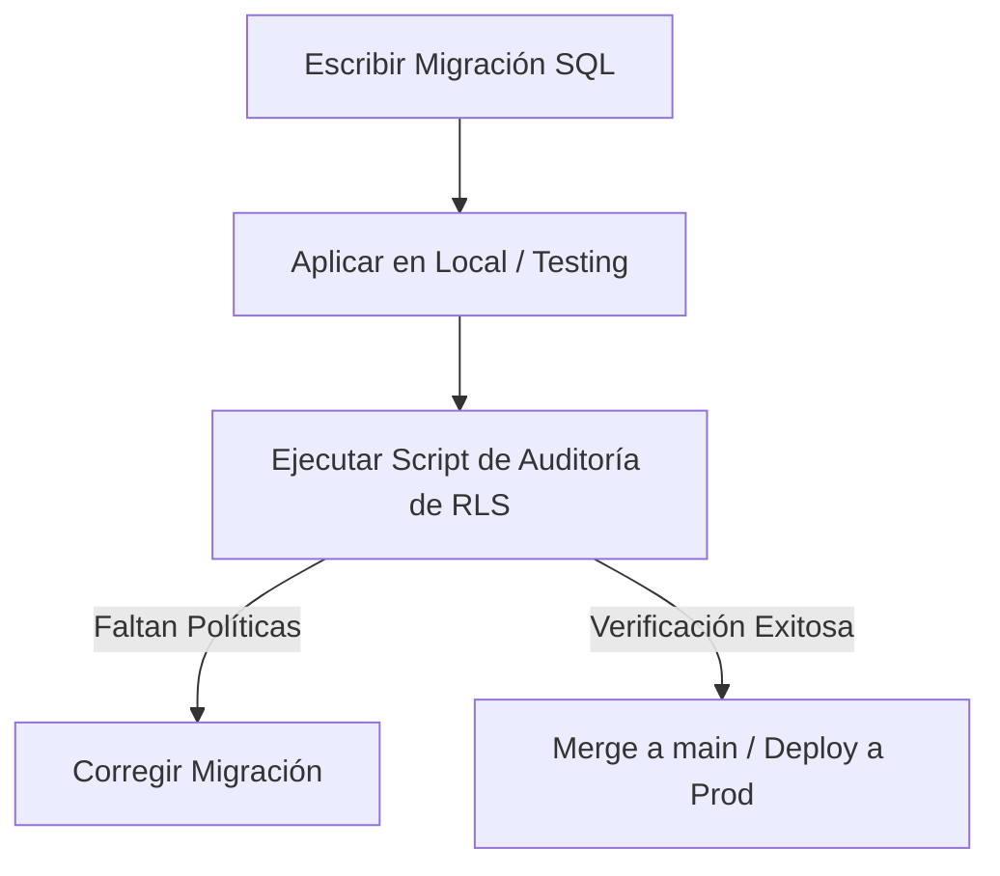

# 🛡️ Protocolo de Prevención de Caídas de RLS y Cambios en Base de Datos

Este protocolo establece los pasos obligatorios para desarrolladores e inteligencias artificiales para asegurar que **nunca** se repita una caída de políticas RLS en producción.

---

## 1. Regla de Oro: Prohibición de `CASCADE` en Producción

> [!WARNING]
> El uso de `DROP FUNCTION ... CASCADE` o `DROP TABLE ... CASCADE` en scripts de migración está **estrictamente prohibido** sin un análisis previo de dependencias.

* **Por qué falló**: PostgreSQL elimina automáticamente (en cascada) todas las políticas RLS, vistas y triggers dependientes cuando se elimina una función o tabla referenciada.
* **El estándar de reemplazo**:
  - Para modificar una función sin cambiar sus parámetros (firma), utiliza siempre `CREATE OR REPLACE FUNCTION`. Esto preserva todas las políticas RLS intactas.
  - Si necesitas cambiar los parámetros de la función, debes **declarar explícitamente la recreación de todas las políticas afectadas** dentro del mismo archivo de migración.

---

## 2. Proceso Obligatorio de Verificación (Local → Testing → Producción)

Antes de que cualquier cambio toque producción, debe seguir este flujo de validación:



1. **Paso 1: Aplicar en Testing**:
   Ejecutar la migración primero en el proyecto de testing (`ubqscyfefgfbmndnypbp`).
2. **Paso 2: Ejecutar Script de Auditoría de RLS**:
   Ejecutar un script automatizado en local o testing para auditar el estado de RLS.
3. **Paso 3: Pruebas de Roles Simulación**:
   Verificar el acceso de datos simulando un usuario con rol limitado (agente) y un administrador para confirmar que las políticas RBAC aíslan la información correctamente.

---

## 3. Script de Auditoría de Políticas (Integrado en el Repositorio)

Hemos creado una herramienta de auditoría en la carpeta `scripts/audit-rls.cjs` que verifica automáticamente si existen tablas con RLS activo pero sin políticas aplicadas (estado de "denegación por defecto").

Este script debe ejecutarse antes de cada despliegue:
```bash
node scripts/audit-rls.cjs
```
